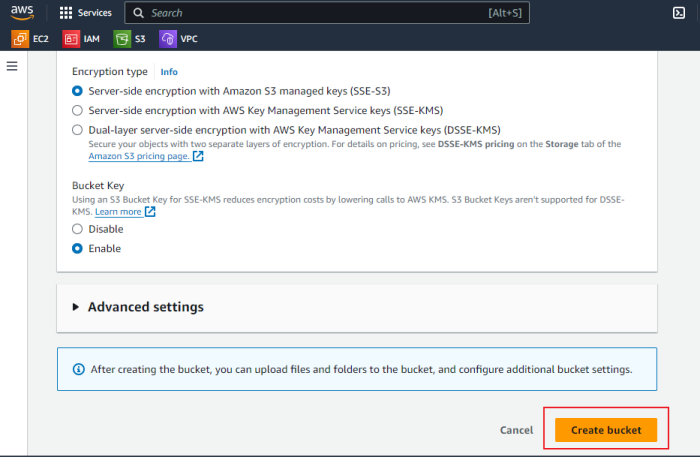

# aws-s3-versioning-replication Project

In this mini-project, I will delve into the versioning and replication features of Amazon S3. The steps include creating an S3 bucket, enabling versioning, configuring cross-region replication, and testing both the versioning and replication functionalities.

### The tools used for this project are:

    1. GitHub: To save my documentation online and for version control.

    2. Git: To clone my repository, create folders, and push my documentation.

    3. Snipaste: For capturing snapshots of images for my documentation.

    4. Visual Studio Code: For writing the documentation.

    5. Markdown: For formatting the documentation.

The following provides a step-by-step approach to how I was able to achieve the project goal:

### Task 1: Create an S3 Bucket
    1. Log in to AWS Management Console.
    2. Navigate to S3 Service.
    3. Create a new bucket:
    4. Click on “Create bucket”.
    5. Enter a unique bucket name.
    6. Choose a region

7. Configure bucket settings as needed (e.g., block public access).

8. Click “Create bucket”.

### Task 2: Enable Versioning
- Open the S3 bucket you created.
- Navigate to the “Properties” tab.

- Scroll to the “Versioning” section.
- Click “Edit”

- Enable versioning.
- Save changes.

### Task 3: Configure Cross-Region Replication
- In the S3 bucket properties, navigate to the “Management” tab.
- Click on “Replication” and “Create replication rule”.

Provide the replication rule ID

### Configure the replication rule:
    To configure the replication rule, I will create another bucket in a different region and set up a new IAM role policy that grants access to all necessary S3 functions for replication.

### Steps to Create Another S3 Bucket in a Different Region
Create a New Bucket:
- Navigate to S3 Service.
- Click on “Create bucket”.
- Enter a unique bucket name
- Choose a different region from the source bucket

- Block public access

- Enable versioning

- Click “Create bucket”.

### Steps to Create IAM Role for Replication
- Navigate to the IAM service.
- Click on “Roles” in the sidebar, then click “Create role”.

- Select “AWS service” as the type of trusted entity.
- Choose “S3” as the service that will use this role.
- Click “Next”.

Attach Permissions Policies:

Attach the following policies:
- AmazonS3FullAccess
- Click “Next”.

- Give the role a meaningful name

- Review the permissions and click “Create role”.

### Steps to Configure Replication Rule
- Source bucket: The bucket I created initially.

- Destination bucket: The new bucket I created in a different region.

- IAM Role: Select the IAM role I created

- Review the replication rule settings.
- Save the rule.

- Replication rule successfully created

### Task 4: Test Versioning
- Upload an object to the S3 bucket.

Modify the object:
- Upload a new version of the same object.

Observe versioning behavior by checking the version history.
1. Go to the object.
2. Click on “Versions” to see all versions of the object.

### Task 5: Test Replication
Verify replication:
- Check the destination bucket in the other region to ensure the object has been replicated.

- Version history of the replicate.

### Importance of S3 Versioning in Maintaining Object History
S3 versioning and cross-region replication are essential features that significantly contribute to data protection, integrity, and availability. By maintaining a comprehensive history of object versions and ensuring geographic redundancy, these features provide robust solutions for data resilience and disaster recovery, enhancing the overall reliability of cloud storage solutions.

### Conclusion
In this mini-project, I explored the versioning and replication features of Amazon S3. The project involved creating an S3 bucket, enabling versioning, configuring cross-region replication, and testing both versioning and replication functionalities.